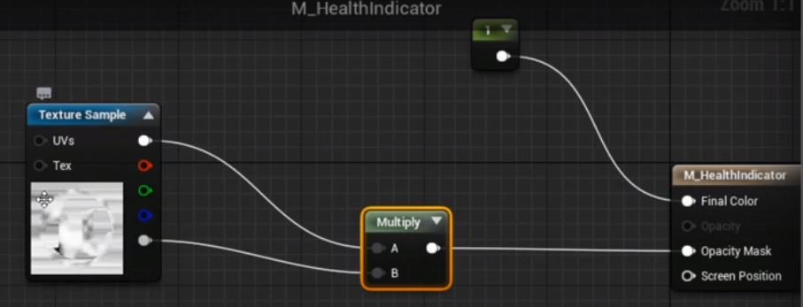
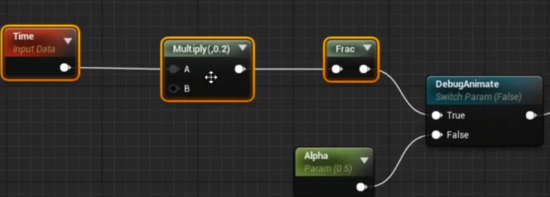

# Components
## 生命值组件
+ 新建Actor Component, SHealthComponent, 创建文件时需要需要在public文件夹下
``` cpp
// OnHealthChanged
DECLARE_DYNAMIC_MULTICAST_DELEGATE_SixParams(FOnHealthChangedSignature, USHealthComponent*, HealthComp, float, Health, float , HealthDleta,....) ;// 其他参数和OnTakeAnyDamage有关

// 可以修改ClassGroup，在之后添加时更容易查找
UCLASS( ClassGroup=(COOP), meta=())

UPROPERTY(BlueprintReadOnly)
float Health
UPROPERTY(EditAnywhere, BlueprintReadWrite)
float DefalutHealth

// 当用于事件或代理时需要添加
UFUNCTION() 
void HandleTakeAnyDamage();

public:
    UPROPERTY(BluePrintAssignable, Category="Events")
    FOnHealthChangedSignature OnHealthChanged;
```
``` cpp
DealutHealth = 100;

// BeginPlay
AActor* MyOwner = GetOwner();
Health = DefalutHealth;
// 通过Alt G来获取其形参
MyOwner->OnTakeAnyDamage.AddDynamic(this, &USHealthComponent::HandleTakeAnyDamage)


// HandleTakeAnyDamage
Health = FMath::Clamp(Health - Damage, 0.0f, DefalutHealth);

UE_LOG(LogGame, Log, TEXT("Health Change: %s"), *FString::SantizeFloat(Health));

OnHealthChanged.Boardcast(this, Health, Damage, DamageType, InstigetedBy, DamageCauser);
```
> 通过GetCapsuleComponents()->SetCollisionResponseToChannel(COLLISION_WEAPON,ECR_Ignore)来修改其碰撞
## 添加死亡动画
``` cpp
UPROPERTY()
USHealthComponent* HealthComp;

UFUNCTION()
OnHealthChanged(...);

UPROPERTY()
bool bDied;
```
``` cpp
HealthComp = ...;

// BeginPlay
HealthComp->OnHealthChanged.AddDynamic(this, &AsCharacter::OnHealthChanged)

// OnHealthChanged
    if(Health < 0 && !bDied)
    {
        // Die
        GetMovemntComponent()->StopMovementImediately();
        GetCapsuleComponent()->SetCollisionEnable(ECollisionEnabled::NoCollision);

        DetatchFromControllerPendingDestroy();
        SetLifeSpan(10.0f);
        bDied = true;
    }
```
+ 找到animation blueprint
+ AnimGraph 添加死亡动画 play Dealth_1, 并且通过一个bDied来判断时运动和死亡（blend poses by pool）, 关闭loop
+ 通过EventGraph set bDied
+ 通过pain Calusing Volume来进行伤害测试
## 伤害反馈
+ 添加T_HealthMask.png并将Group修改为UI，关闭sRGB
+ 新建一个Meterial， M_HealthIndicator
+ 将T_HealthMask.png加入M_HealthIndicator, 设置HealthIndicator， User iterface
+ 
+ 
### 创建Widge
+ 创建WBP_HealthIndicator
+ 添加Image, 设置位置
+ Apperance/brush 设置材质
+ 添加至viewport
+ 在widge的construct中通过bind Event to On Health CHanged来绑定事件
+ 并通过Get Dynamic Material和Set Scalar Parametes Value来对变量Alpha进行赋值
### 创建爆炸桶
+ RadialForceComponent