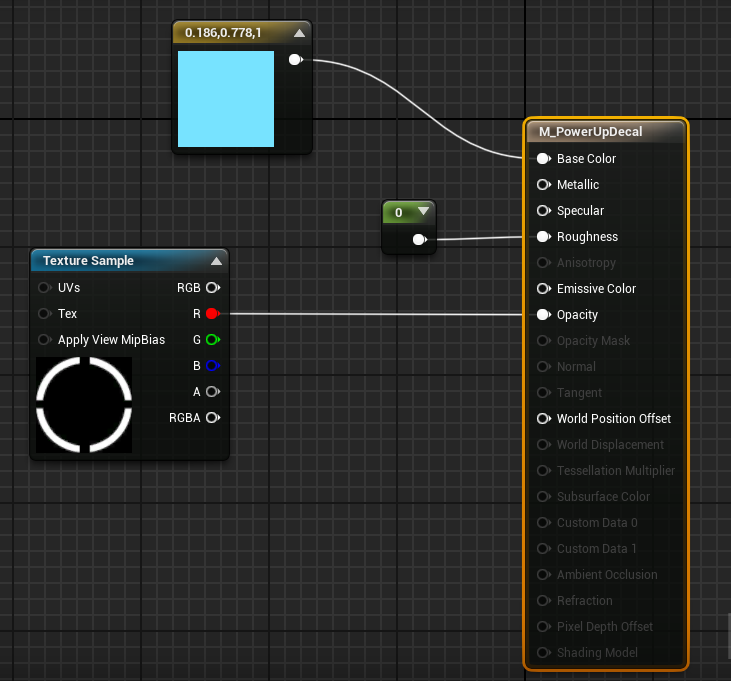
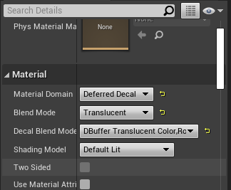

# PowerUps
## 创建文件
### 创建PickUp Class
+ 创建SPickUpActor.cpp : Actor
+ 添加SphereComp和DecalComp
+ 给DecalComp设置Rotator使其能够在蓝图中更好的显示
+ Decal Size(64,75,75), SphereRadius(75.0f);
+ delete Tick
### 创建PowerUp Class
+ 创建SPowerUpActor : AActor
+ Delete Tick
``` cpp
    UPEORPERTY(...)
    float PowerUpInterval;
    UPEORPERTY(...)
    /* Total times we  apply the powerup effect */
    int32 TotalNrOfTicks;

    int32 TicksProcessed;

    FTimerHandle TimerHandle_PowerUpTick;

    UFUNCITON()
    void OnTickPowerUup();


public:

    void ActivatePowerup();

    UFUNCITON(BlueprintImplementableEvent, Category="PowerUps")
    void OnActivated();

    UFUNCITON(BlueprintImplementableEvent, Category="PowerUps")
    void OnPowerUpTicked();

    UFUNCITON(BlueprintImplementableEvent, Category="PowerUps")
    void OnExpired();
```
``` cpp
// ACtivatePowerup
if(PowerupsInterval > 0.0f)
{
GetWorldTimerManager().SetTimer(...);
}else 
{
    //...
}
// OnTickPowerup 该函数用以判断是否过期，并对时间进行更新
OnPowerUpTicked();
OnExpired();
```
## Super Speed Power-Up
### 新建
+ 添加所需文件
+ M_PowerupDecal, Deferred Decal, Translucent, Color_rougness, 添加Texture Sample
+ 创建PowerUp_SuperSpeed : SPowerUp
+ 通过Activated事件来设定Max Walk Speed


### PickUpActor
``` cpp
UPROPERTY(EditDefalutOnly, Category="PickupActor")
TSubclassOf<ASPowerupActor> PowerUpClass;

ASPowerupActor* PowerUpInstance;

UPROPERTY(EditDefalutOnly, Category="PickupActor")
float CoolDownDuration;

FTimerHandl TimerHandler_Respawn;

void Respawn();
```
``` cpp
// BeginPlay
    Respawn();
// Respawn
    if(PowerUpCLass == nullptr)
    {
        UE_LOG();
        return;
    }
    FActorSpawnParameters SpawnParams;
    // ...
    PowerUpInstance = GetWorld()->SpawnActor<ASPowerupActor>(PowerUpClass, GetTransform(), SpawnParams);
// NotifyActorBeginOverlap
    ActivatePowerup();
    powerUpInstance = nullptr;
    // Set Timer to Respwan
```
创建M_Powerup