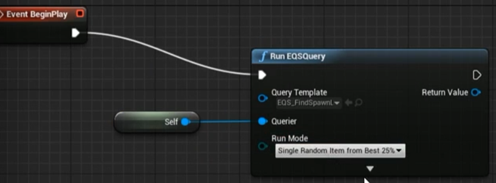

# Level
## Game Mode Class
### 创建
+ SGameMode : GameModeBase
+ 删除两个无用的与GameMode相关的文件
+ 创建BP_TestGameMode, 并修改其父类为SGameMode
### BP_TestGameMode
+ Run EQSQuery
+ editor Preferentce -> environment -> Environment system(true) -> Restart Editor
+ 新建Enviroment Query, EQS_FindSpawnLocation
### EQS_FindSpawnLocation
+ SimpleGrid.GenerateAround = EnvQueryContext_Querier
+ 新建一个蓝图EnvQueryContext_BotSpawns : EnvQueryContext
+ Funciton -> overide -> provide Actors Set
+ Get All Actors of Class, Actor Class = TargetPoint
+ SimpleGrid.GenerateAround = EnvQueryContext_BotSpawns
+ 蓝图 BP_EQSTestingPawn ：EQSTestingPawn
+ 将BP_EQSTestingPawn拖入视口，设置Query Template = EQS_FindSpawnLocation
+ 将Target Point 拖入视口来生成点状网络



+ 在EQS_FindSpawnLocation中 Add Test Disteance
+ 新建一个蓝图 EnvQueryContext_AllPlayers : EnQueryContext_BlueprintBase
+ 在该蓝图中Get All Actors of Class, Actor Class = SCharacter
+ 设置EQS_FindSpawnLocation中distance中的类为EnvQueryContext_AllPlayers, 并设置好距离
## Spawn AI Using EQS
+ Bind Event to OnQueryFinishedEvent
+ Switch on EEnvQueryStatus
+ Get Results as Location
+ ForEachLoop, DrawDebugSphere
+ SpawnActor BP Tracker Bot, 设置 Try To Adjust...
+ Make Transfrom, 
### SGameMode
``` cpp
protected:
FTimeeHandler TimerHandle_BotSpawner;

int32 NrofBotsToSpawn;

int32 WaveCount;

UPEOPERTY(EditDefalutOnly, Category="")
float TimerBetweenWaves;

UFUNCTION(BlueprintImpelmentcableEvent)
void SpawnNewBot();

void SpawnBotTimerElasped();

void StartWave();

void EndWave();

// Set timer for next startwave
void PrepareForNextWave();
public:
virtual void StartPlay() override;

ASGameMode();
```
``` cpp
ASGameMode()
{
    TimeBetweenWave = 2;
}


StartWave()
{
    WaveCount++;

    NrOfBotsToSpawn = 2 * WaveCount;

    GetWorldTimerManager().SetTimer(TimerHandle_BotSpawner, this, ...);
}

SpawnBotTimerElasped()
{
    SpawnNetBot();

    NrOfBotsTOSpawn--;
    
    if(NrOfBotsTOSpawn <= 0)
    {
        EndWave();
    }
}

StartPlay()
{
    Super::;
    PrepareForNextWave();
}

EndWave()
{
    GetWorldTimerManager().ClearTimer(TimerHandle_SpawnNewBot);
    PrepareNextWave();
}

PrepareNextWave()
{
    FTimerHandler TimerHandle_NextWaveWaveStart;
    GetWorldTimerManager().SetTimer(TimerHandle_NextWaveWaveStart, this, ...StartWave);
}
```
### More Logic
``` cpp
void CheckWaveState();

FTimerHande TImrHandle_NextWaveStart
public:
virtual void Tick() override;
```
``` cpp
ASGameMode()
{
    PrimaryActorTick.TickInterval = 1.0f;
    PrimaryActorTick.bCanEverTick = true;
}

void CheckWaveState()
{
    bool bIsPreparingForWave = GetWorldTimerManager().IsTImerActive(TimerHandle_NextWaveStart);
    // 前面添加的限制条件，防止已经准备生成但是没有生成时导致的重复的prepare
    if(NrOfBotToSpawn > 0 || bIsPreparingForWave)
    {
        return;
    }

    bool bIsAnyBotAlive = false;
    for(FConstPawnIterator It = GetWorld()->GetPawnIterator())
    {
        APawn* TestPawn = It->Get();
        if(TestPawn == nullptr || TestPawn->IsPlayerControlled())
        {
            continue;
        }
        USHealthCOmponent* HealthComp = Cast TestPawn->GetComponentByClass(USHealthComponent::StaticCLass());
        if(HealthComp && HealthComp->GetHealth() > 0.0f)
        {
            bISAnyBotAlive = true;
            break;
        }
    }
    if(!bIsAnyBotAlive)
    {
        PrepareForNextWave();
    }
}

Tick()
{
    Super::Tick();
    CheckWaveState();
}
```
### Player State
``` cpp
void CheckAnyPlayerAlive();

void GameOver();
```
``` cpp
CheckAnyPlayerAlive()
{
    for(FConstPlayerControllerIterator It = GetWorld()->GetPlayerControllerIterator(); ++It)
    {
        APlayerController* PC = It->Get();
        if(PC && PC->GetPawn())
        {
            APawn* MyPawn = PC->GetPawn();
            HealtComp = Cast MyPawn->GetComponentByClass(USHealthComponents::StaticsClass());
            if(ensure(HealthComp) && HealthComp->GetHealth() > 0.0f) //如果HealComp为空会进行断点
            {
                return;
            }
        }
    }
    // No Player alive
    GameOver();
}
GameOver() 
{
    EndWave();
    // @todo Game over
}
Tick()
{
    CheckAnyPlayerAlive();
}
```
## Game State
+ SGame State : Game State Base
``` cpp
UENUM(BlueprintType)
enum class EWaveState : Unit8
{
    WatingToStart

    WaveInProgress,

    WaitingToComplete,

    WaveComplete,

    GameOver,
}

{
    UFUNCTION()
    void OnRep_WaveState(EWaveState OldState);

    UFUNCTION(BlueprintImplementableEvent, Category="WaveState")
    void WaveStateChange(EWaveState NewState, EWaveState OldState);

    UPROPERTY(BlueprintReadOnly, ReplicatedUsing=OnRep_WaveState, Category="GameState")
    EWaveState WaveState;
}
```
``` cpp
#include "Net/UnralNetwork.h"

OnRep_WaveState(Old State)
{
    WaveStateChanged(WaveState, OldState);
}

GetLifetimeReplicatedProps()
```
GameMode
``` cpp
enum class GameStats : Uint8;

void SetWaveState(EWaveState NewState)

```
``` cpp
#include "SGameState.h"

GameStateClass = ASGameState::StatcClass();

SetWaveState()
{
    ASGameState* GS = GetGameState<ASGameState>();
    if(ensureAlways(GS))
    {
        GS->WaveState = NewState;
    }
}
```
### Game Setup
+ 创建BP_GameState
+ override wave state change

> 此时在状态改变时在主机上仍无法调用，因为RepNotify不会在服务端上运行， 因此需要自己触发函数

``` cpp
public:
void SetWaveState(EWaveState NewState);
```
``` cpp
SetWaveState()
{
    If(Role == RO...)
    {
        WaveState = NewState;
        // Call on server
        OnRep_WaveState();
    }
}
```
### Add Score for kills
+ 创建 SPlayerState : player State

``` cpp
public:
UFUNCTION(BlueprintCallable, Category="")
void AddScore(float ScoreDelta);
```
``` cpp
AddScore()
{

}
```
GameMode.cpp
``` cpp
// Killed actor, killer actor
DECLARE_DYNAMIC_MULTICAST_DELEGATE_ThreeParams(FOnActorKilled, AActor*, VictimActor, AAcot* KillerActor, AController* KillerController)

public:
UPROPERTY(BlueprintAssignable, Category="GameMode")
FOnActorKilled OnActorKilled;
```
``` cpp
ASGameMode
{
    PlayerStateClass = ASPlayerState::StaticClass();
}
```
HealthComp
``` cpp
bool bIsDead;
```
``` cpp

HandleTakeDamage()
{
    if(BIsDead ...)
    //...
    bIsDead = Health <= 0.0f;
    if(bIsDead)
    {
        ASGameMode* GM = Cast GetWorld()->GetAuthGameMode();
        if(GM)
        {
            GM->OnActorKilled.Brocast(GetOwner(), DamageCauser, InstigatorBy);
        }
    }
}
```
> beginPlay Assign Event to Add Score(注意杀死玩家不加分的), 同时可以试试为什么不可以用蓝图实现的事件来完成下面的过程。
### Respawn Death player
GameMode
``` cpp
void RestartDeadPlayers();
```
``` cpp
RestartDeadPlayers()
{
    for(FConstPlayerControllerIterator It = GetWorld()->GetPlayerControllerIterator(); ++It)
    {
        APlayerController* PC = It->Get();
        if(PC && PC->GetPawn() == nullptr)
        {
            RestartPlayer(PC);
        }
    }
}
```